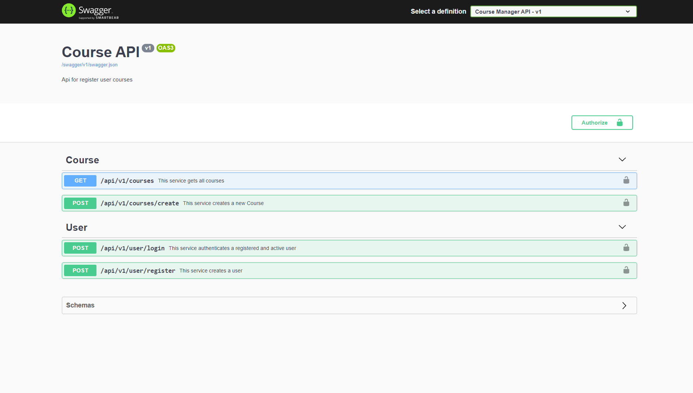

# Course Manager Api-v1

This API allows a user to register and get courses

Made with ASP.NET 5.0 + SQL Server and documented with [Swagger](https://swagger.io/tools/swagger-ui/)

### **Features:**

  **Authorization**: [JWT](https://jwt.io/introduction)

  **User**:
   - Auto register 
   - Login 

  **Course**:
   - Register
   - Get all(by user)

​    
